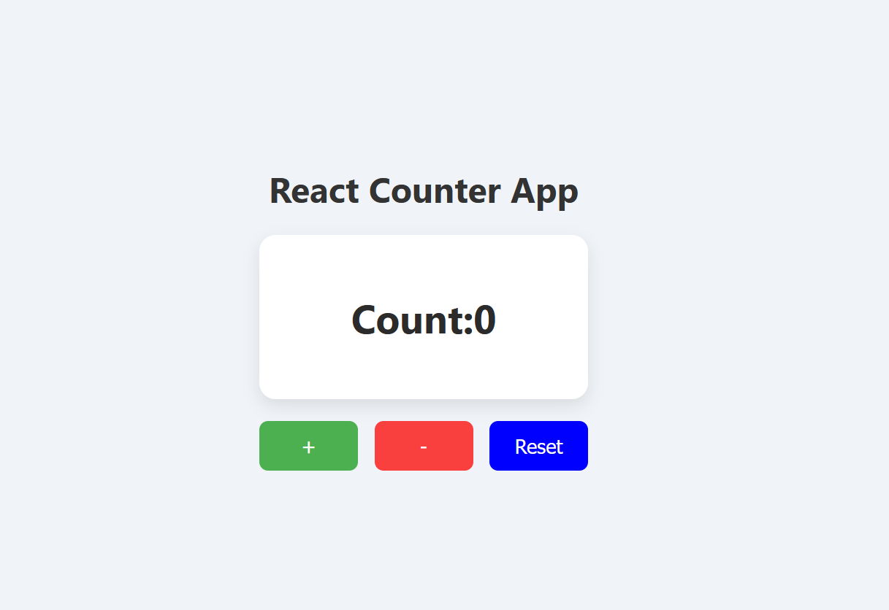

# React Counter App 🔢

A responsive and modern counter app built with React functional components, hooks, and semantic HTML.

## 🚀 Features

- Increment, decrement, and reset functionality
- Semantic HTML structure using `<main>`, `<section>`, `<article>`
- Responsive layout with modern CSS (transitions, transforms, flexbox)
- Clean file structure for scalability

## 🛠️ Tech Stack

- React (Functional Components + Hooks)
- HTML5 (Semantic)
- CSS3 (Flexbox, Transitions)
- Git & GitHub

## 📦 Getting Started

Clone the repository and install dependencies:

```bash
git clone https://github.com/ybhavanareddy/react-counter-app.git
cd react-counter-app
npm install
npm startThis will run the app on http://localhost:3000.

## 📸 Demo




📄 License
This project is licensed under the MIT License.
